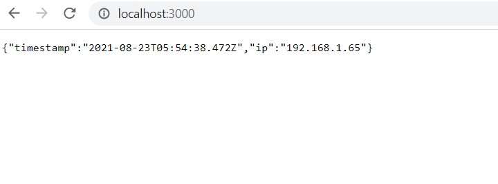

# Pre-Reqs
1. Node.js installed on your host machine (https://nodejs.org/en/download/)
2. Docker Desktop installed on your host machine (https://docs.docker.com/desktop/)
3. Kubernetes installed on your host machine (https://kubernetes.io/releases/download/)

    - Note: It is important to install minikube as well. This will allow you to test/create kubernetes clusters locally quicker and faster.(https://minikube.sigs.k8s.io/docs/start/)
# Deploy a microservice to K8's cluster

*The node app (app.js)*
- This simple web server utilizes the express.js framework to simplify the creation of a microservice.
- Starting in the app.js file, the app starts a server on port 3000.
- A GET request is made and returns a json response back to the client. 
- The app utlizes an npm package called 'ip' to obtain the current user's ip address and a built in 'Date' class to obtain the current date/time.

*Dockerfile* 

- The docker file contains a list of commands that will build the image.
- The file specifies exactly what image we want to build from. In this particular case it is the latest stable version of node (Quick note here, utlizing the 'latest' version of node posed a few problems. Check node documentation for the latest long-term STABLE version)


- It is also important to include a .dockerignore file to prevent any large or important/private files from being sent to the daemon. 


*Kubernetes manifest (microservice.yml)*
- The kubernetes manifest includes descriptions for various resources and exactly how they will run within the cluster. 
- A deployment and service are included in one manifest in this project, but these can be split into separate manifests for larger projects.

- The deployment section of the manifest file creates two replicas (pods). It includes some metadata and specifies the image to pull from docker hub. 


- The service section of the manifest file creates an abstraction for Pods and helps expose an application (service) externally.
 
    - Note: notice the ```---``` on line 20 in the screen shot. This allows you to create multiple objects inside of a single manifest file and separate them. 


# Steps to test and deploy
1. Navigate into the directory where the app lives.
2. Run this command in shell of your choice once you are in the app directory ==> 

    ```node app.js```

3. Navigate to *http://localhost:3000*
4. You should receive a response that looks like this  
5. Next, construct dockerfile to build the docker image. 
 
6. Inside of the directory where the dockerfile lives, (in this case it will live in the app directory)
run this command ==> 

    ``docker build -t [dockerhubusername]/[dockerrepositoryname]`` 
    
This convention is best practice for a seamless push to docker hub. The '[dockerhubusername]/[dockerrepositoryname]' will become the 'appname'.

7. Once the image is built, run the image with this command ==> 

    ```docker run -p 3000:3000 -d [appname]```
Test your container by navigating to its port or run ```docker info``` to ensure your container is running
8. Once the container is tested, push the image to docker hub with this command 

    ``` docker push [appname] ```

    - Note: you will need to run 
    
    ```docker login``` and then login to your dockerhub account using your credentials before you can push. Make sure the repository you push to is public

9. After pushing the image, ensure you have a running cluster. (for a faster test, utilize minikube) 
10. Run:

    ```kubectl apply -f microservice.yml```


# Link to Docker Image 
https://hub.docker.com/repository/docker/sgracia13/sebnodeapp

